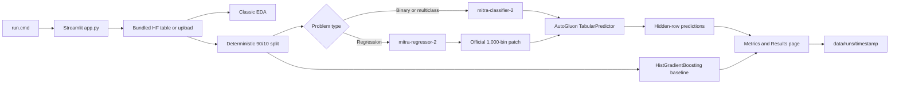

# Glass Box architecture

Glass Box is one native Windows Streamlit process. It does not use a model
server, Ollama, Agnes, WSL, or Docker.

## Application layers

`app.py` configures the page, initializes shared state, applies the dark theme,
and registers eight pages with `st.navigation`. Header toggles and sidebar
controls are shared across pages.

`src/load.py` owns dataset downloads, upload parsing, normalization, caching,
and deterministic splitting. Bundled tables are cached under `data/hf/` as
Parquet plus metadata. A catalog source change invalidates that table once;
unchanged sources are loaded from disk.

`src/state.py` resolves the current table, target, and problem type. Before a
model run, `src/mitra_run.py` requires binary targets to contain exactly two
classes, multiclass targets to contain 3–20 classes, and regression targets to
be numeric.

`src/mitra_run.py` accepts explicit training and test tables, chooses the
checkpoint, applies the official released regression-head compatibility patch
when required, fits AutoGluon MITRA, and fits one scikit-learn
HistGradientBoosting baseline on the same split. The baseline is a teaching
reference, not a full AutoML comparison.

## Model and artifact flow

Classification always uses `autogluon/mitra-classifier-2`. Regression always
uses `autogluon/mitra-regressor-2`; its 1,000-bin distributional head is wired
through `mitra_finetune.patches.install_reg_ce_patches` from the pinned official
package.

Each run writes to `data/runs/<UTC timestamp>/`:

- `flags.json`: selected head, toggles, device, fitted model names, and time limit.
- `metrics.json`: MITRA/baseline metrics and run metadata.
- `predictions.csv`: actual, MITRA, and baseline predictions.
- `leaderboard.csv`: AutoGluon validation leaderboard for the fitted predictor.
- `run.log`: timestamped tutorial log.
- `predictor/`: persisted AutoGluon predictor.

The Results selector resolves approved pointers under `data/cache/` for the
regression and classification zero-shot and fine-tuned variants. A current
in-session run appears as an additional choice. These runtime artifacts and
downloaded tables are ignored by Git.

## Credentials and device selection

Hugging Face calls read `HF_TOKEN` from the Windows process environment and
never display or persist its value. The copied `.env` file is not parsed as a
credential source.

`torch.cuda.is_available()` selects `num_gpus=1`; otherwise the fit receives
`num_gpus=0` and the UI shows a CPU time warning. No CUDA-specific Torch wheel
is pinned, so the launcher remains usable on CPU-only Windows systems.
