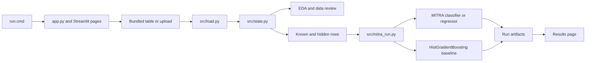

# System Architecture

Glass Box is a Windows-native Streamlit tutorial organized around one user-visible path: choose or upload a table, inspect it, create a known/hidden split, run a selected MITRA head, and review saved predictions beside a reference baseline. The app does not certify the quality or trustworthiness of input data.

## Runtime and page ownership

[`app.py`](../../app.py) configures Streamlit, initializes shared session state, applies the shared theme and navigation controls, then registers eight pages. Page modules render the UI; shared modules own state and the data/model mechanisms.

The main ownership boundaries are:

- `app_pages/` presents Home, Data, EDA, comparison, model explanation, training, results, and a generated Python reproduction script.
- `src/state.py` resolves the active table, target, task, and run settings for those pages.
- `src/data_catalog.py` declares the bundled tutorial samples and their source policies; `src/load.py` handles source reads, uploads, normalization, caching, and split metadata.
- `src/eda.py` supplies data inspection and figure helpers without owning model execution.
- `src/mitra_run.py` validates runner inputs, selects the released model head, fits MITRA and a same-split baseline, computes metrics, and persists run evidence.

The shared page setup and module responsibilities are described in [`app.py`](../../app.py), the [architecture guide](../../docs/ARCHITECTURE.md), and the [developer source map](../../docs/DEVELOPER_GUIDE.md).

## End-to-end flow

For bundled data, the loader tries the catalog source and configured fallbacks, normalizes the resulting frame, and stores the table plus split metadata in the local cache. User uploads enter through the same metadata and split policy. The model runner receives the known and hidden tables explicitly.

## Model and result boundary

Classification selects `autogluon/mitra-classifier-2`; regression selects `autogluon/mitra-regressor-2`. The regressor path installs the released regression-head compatibility patch before predictor construction. The runner also fits one scikit-learn HistGradientBoosting baseline on the same training and hidden rows. This is a reference point, not a full AutoML comparison.

Each successful run is stored under `data/runs/<UTC timestamp>/` with flags, metrics, predictions, a leaderboard, a timestamped log, and a persisted predictor. Failures preserve `error.json` and the run log. The Results page can load approved cache pointers for zero-shot and fine-tuned runs, and can display a current in-session result.

Model metrics describe performance on the selected hidden split. They do not establish that a dataset is accurate, representative, fair, causally valid, or trustworthy. See [Evaluation and Trust Boundary](../concepts/evaluation-and-trust-boundary.md) for that distinction and [Model Training and Results](../workflows/model-training-and-results.md) for the execution lifecycle.

## Credentials and device selection

Hugging Face access reads `HF_TOKEN` from the process environment. The copied `.env` file is not the runtime credential source, and the application does not display or persist the token. Device selection uses `torch.cuda.is_available()`: the runner configures one GPU when CUDA is available and zero otherwise. CPU zero-shot execution is supported; fine-tuning and eight-copy workflows have separate hardware and time requirements.

For launch steps see [Quickstart](../quickstart.md) and [Windows Setup and Credentials](../operations/windows-setup-and-credentials.md). For the focused checks that exercise these boundaries see [Smoke Check Map](../testing/smoke-checks.md).
